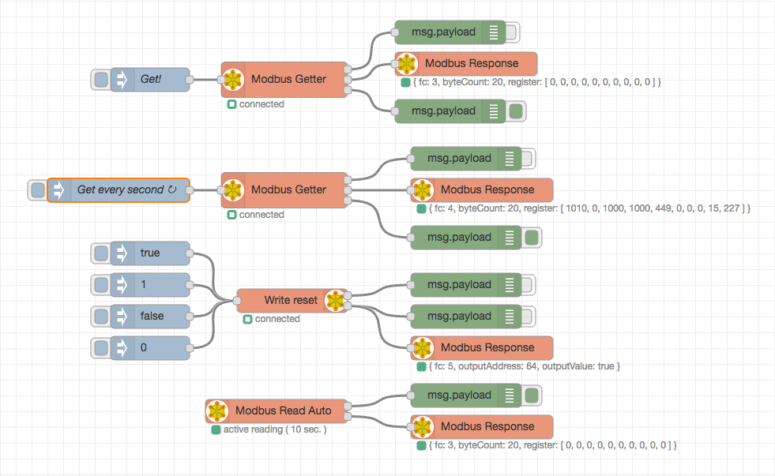

node-red-contrib-modbus
========================

[Node-Red][1] Modbus node package.

Based on [jsmodbus][2].

# Install

Run the following command in the root directory of your Node-RED install

    npm install node-red-contrib-modbus

Run the following command for global install

    npm install -g node-red-contrib-modbus

# How to use

# Author

* since 2015 [Mika Karaila][4]
* since 2016 [Klaus Landsdorf][5]

# Co-Author disconnected branch

* since 2016 [Jason D. Harper][3]

[1]:http://nodered.org
[2]:https://www.npmjs.com/package/jsmodbus
[3]:https://github.com/jayharper
[4]:https://github.com/mikakaraila
[5]:https://github.com/biancode